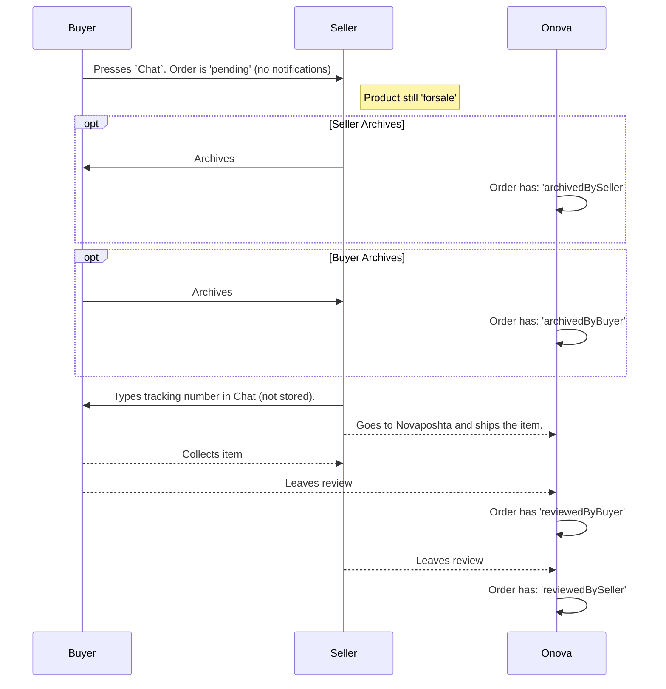

# Order Process

Rules:

- Buyer creates an order when he/she presses the Chat button. The product cannot be reserved.

```mermaid
sequenceDiagram
    Buyer  ->>  Seller:   Presses `Chat`. Order is 'pending' (no notifications)
    Note right of Seller: Product still 'forsale'

    %% opt Fail to confirm
    %%    Note over Seller:  Fails to confirm (notif. Seller & Buyer)
    %%     Onova  ->>  Onova: Order is: 'failed_by_seller'. (first warning?)
    %%    end
    opt Seller Archives
        Seller ->>  Buyer:    Archives
        Onova  ->>  Onova:    Order has: 'archivedBySeller'
    end
    opt Buyer Archives
        Buyer ->>   Seller: Archives
        Onova  ->>  Onova:  Order has: 'archivedByBuyer'
    end

    Seller   ->> Buyer: Types tracking number in Chat (not stored).
    Seller -->>  Onova:  Goes to Novaposhta and ships the item.
    
    Buyer -->> Seller:   Collects item
    Buyer -->>  Onova:   Leaves review
    Onova  ->>  Onova:   Order has 'reviewedByBuyer'
    Seller -->>  Onova:  Leaves review
    Onova  ->>  Onova:   Order has: 'reviewedBySeller'
```

## Legend

- Onova is here also UAPAY and Novaposhta