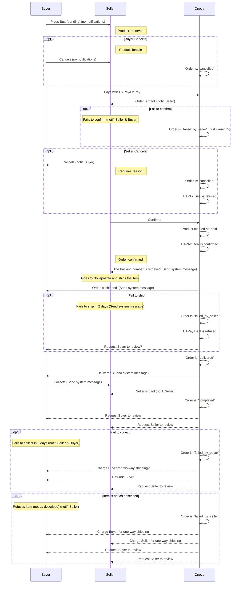

# Order Process

Rules:

- The product is reserved when buyer presses Buy
- The buyer has 15 minutes to make payment
- The seller then has 48 hours to confirm order
- The seller has 2? days to ship order
- The buyer has 5? days to collect package after is delivered

## Status updates and system messages:

| Order status        | Send push notif. to | Send review reminder to | Send system message? | Notes                                              | Refunds / Payments notes                              |
| ------------------- | ------------------- | ----------------------- | -------------------- | -------------------------------------------------- | ----------------------------------------------------- |
| `pending`           | _nobody_            | _none_                  | _n/a_                |                                                    |                                                       |
| `cancelled`         | _nobody_            | _none_                  | _n/a_                | Buyer cancels before paying or doesn't pay in time |                                                       |
| `paid`              | seller              | _none_                  | _n/a_                |                                                    | Buyer pays item price + shipping fee                  |
| `failed_by_seller`  | buyer (TODO)        | buyer?                  | _n/a_                | Fails to confirm                                   | Buyer gets 100% back?                                 |
| `cancelled`         | buyer (TODO)        | _none_                  | _n/a_                | Seller cancels with a reason                       | Buyer gets 100% back?                                 |
| `confirmed`         | _nobody_            | _none_                  | yes                  | Includes tracking number                           |                                                       |
| `shipped`           | _nobody_            | _none_                  | yes (TODO)           |                                                    |                                                       |
| `failed_by_seller`  | ?                   | buyer?                  | yes?                 | Fails to ship                                      | Buyer gets 100% back?                                 |
| `delivered` (TODO?) |                     | _none_                  | yes (TODO)           |                                                    |                                                       |
| `completed`         | _nobody_            | buyer + seller          | yes (TODO)           | Buyer collected the item :tada:                    | Seller gets paid = item price - UAPay fee - Onova fee |
| `failed_by_buyer`   | seller?             | buyer? + seller         | no?                  | Failed to collect                                  | Seller pays for two-way shipping?                     |
| `failed_by_seller`  | seller?             | buyer + seller          | no?                  | Refuses item (not as described)                    | Seller pays for two-way shipping?                     |

## Notes

- Onova is here also UAPAY and Novaposhta