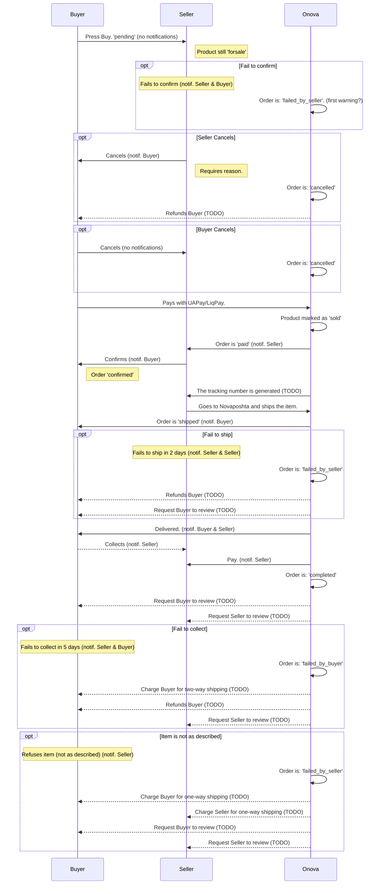

# Order Process

Rules:

- Buyer needs to pay immediately. The product is not reserved when he/she presses Buy
- We're not requesting funds to be frozen until the Seller confirms

## Legend

- Onova is here also UAPAY and Novaposhta