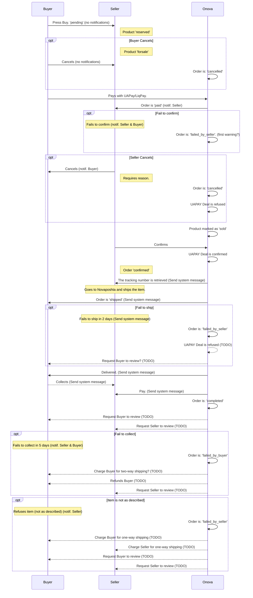

# Order Process

Rules:

- The product is reserved when buyer presses Buy
- The buyer has 15 minutes to make payment
- The seller then has 48 hours to confirm order
- The seller has 2? days to ship order
- The buyer has 5? days to collect package after is delivered

## Legend

- Onova is here also UAPAY and Novaposhta